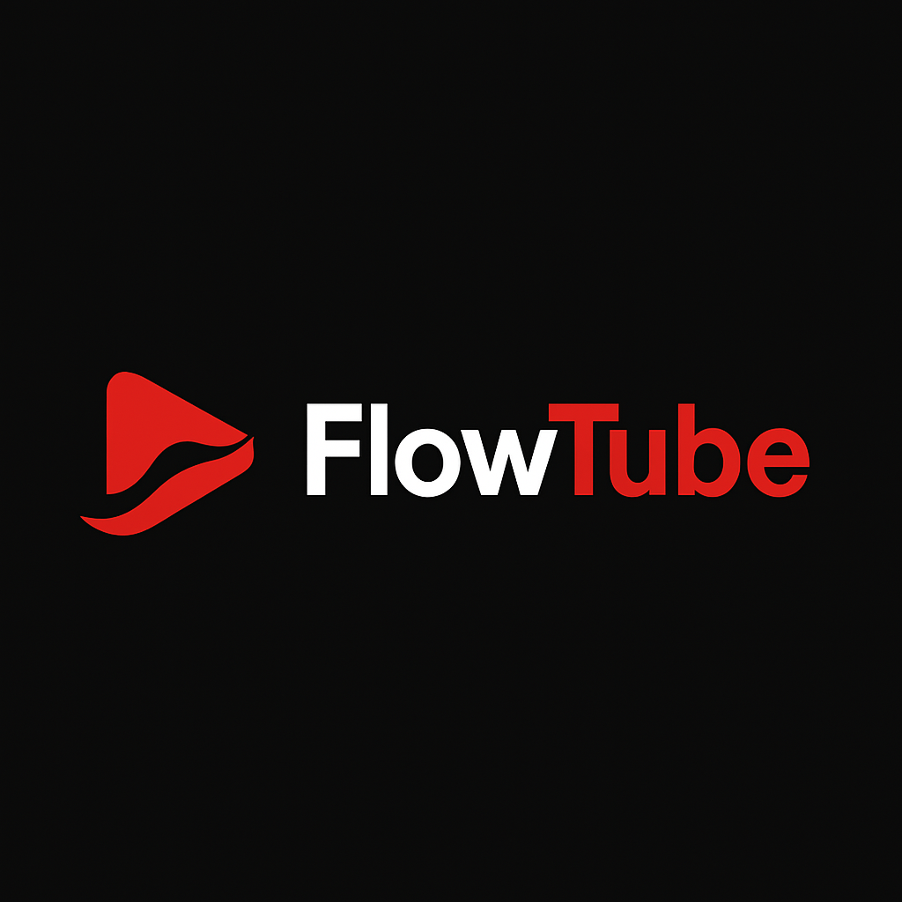

<p align="center">
  
</p>

**FlowTube** is a web application that creates a personalized YouTube video feed based on your favorite channels and keywords of interest.

> Developed by [Am I Artificial Intelligence](https://ami.digital) | [GitHub](https://github.com/amiartint/flowtube)
>
> Inspired by JGravelle's [YourTubes](https://github.com/jgravelle/YourTubes) project.

## Features

### Modern and Intuitive Interface
- **Channel Management**: Interface with tabs to add and remove channels with friendly names
- **Pagination System**: Easy navigation between sets of videos
- **Responsive Design**: Adapts to different screen sizes

### Personalized Content
- **Customized Feed**: Aggregate videos from multiple YouTube channels into a single feed
- **Keyword Filtering**: Filter videos based on specific keywords
- **Date Sorting**: Videos organized by publication date (most recent first)

### Viewing Experience
- **Integrated Playback**: Watch videos directly in the application with a responsive player
- **Viewing History**: Identification of already watched videos with visual indicator
- **Custom Controls**: Easy navigation between videos and player

### Customization and Persistence
- **Persistent Configuration**: Your preferences are saved between sessions
- **Internationalization**: Interface available in Portuguese and English
- **Quantity Adjustment**: Control the number of videos displayed per channel

## Installation

### Prerequisites

- Python 3.8 or higher
- Pip (Python package manager)
- YouTube API Key (get it from [Google Cloud Console](https://console.cloud.google.com/))

### Installation Steps

1. Clone the repository:
   ```bash
   git clone https://github.com/amiartint/flowtube.git
   cd flowtube
   ```

2. Create and activate a virtual environment:
   ```bash
   python -m venv venv
   
   # On Windows
   venv\Scripts\activate
   
   # On macOS/Linux
   source venv/bin/activate
   ```

3. Install dependencies:
   ```bash
   pip install -r requirements.txt
   ```

4. Configure your API key:
   - Copy the `.env.example` file to `.env`
   - Edit the `.env` file and add your YouTube API key:
     ```
     YOUTUBE_API_KEY=your_api_key_here
     ```

## Usage

1. Start the application:
   ```bash
   streamlit run main.py
   ```

2. Access the application in your browser (usually at http://localhost:8501)

3. Configure your channels:
   - In the "Add Channel" tab of the sidebar, enter the YouTube channel URL
   - Optionally, add a friendly name for the channel
   - Click on "Add Channel"
   - Manage your channels in the "Manage Channels" tab

4. Configure keywords and preferences:
   - Add keywords to filter videos (one per line)
   - Adjust the maximum number of videos per channel using the slider
   - Click on "Save Configuration" to apply the changes

5. Navigate through your personalized feed:
   - Videos are displayed in a grid organized by publication date
   - Use pagination controls to navigate between sets of videos
   - Already watched videos are marked with a blue indicator
   - Click on "Play Video" to watch directly in the application
   - Use the "Refresh Videos" button to fetch new content

6. Customize the language:
   - Select between Portuguese and English in the language selector in the sidebar

## Project Structure

```
FlowTube/
│
├── data/                  # Directory for user data
│   └── config.json        # Configuration file
│
├── translations/          # Directory for translation files
│   ├── en.json            # English translations
│   └── pt.json            # Portuguese translations
│
├── utils/                 # Directory for utility modules
│   ├── __init__.py        # File to mark as Python package
│   └── i18n.py            # Internationalization system
│
├── main.py                # Main application
├── requirements.txt       # Project dependencies
├── .env                   # Environment variables (not included in the repository)
├── .env.example           # Example of environment variables
├── README.md              # This file
└── LICENSE                # License file
```

## How It Works

1. **Channel Management**: The application allows adding and removing YouTube channels using a tabbed interface, storing both the URL and a friendly name for each channel.

2. **Data Retrieval**: The application uses the YouTube API to fetch the most recent videos from configured channels.

3. **Filtering**: Videos are filtered based on provided keywords (if any).

4. **Sorting and Pagination**: Videos are sorted by publication date (most recent first) and organized into pages for easy navigation.

5. **Playback**: Videos can be watched directly in the application through a responsive player, and the system keeps a history of already watched videos.

6. **Caching**: Results are cached for 24 hours to improve performance and reduce API calls.

7. **Internationalization**: The user interface is dynamically translated based on the selected language (Portuguese or English).

## API Limitations

- The YouTube API has daily usage quotas. If you are following many channels or updating too frequently, you may reach these limits.
- The application uses only the API key for authentication, which limits some functionalities.

## Customization

### Adding New Languages

FlowTube's internationalization system is based on JSON files. To add a new language:

1. Create a new JSON file in the `translations/` folder with the language code as the name (e.g., `de.json` for German)
2. Copy the content of an existing file (such as `en.json`) and translate the values
3. Update the `utils/i18n.py` file to include the new language in the list of supported languages

### Future Improvements

Some improvements planned for upcoming versions:

#### Interface and User Experience
- **Dark/Light Theme**: Option to switch between viewing modes
- **Support for more languages**: Expansion of the internationalization system
- **Statistics Visualization**: Graphs and data about followed channels

#### Advanced Features
- **Video Categorization**: Organization by themes or custom tags
- **List Export**: Sharing of video collections
- **"Watch Later" List**: Marking videos for future viewing

#### Technical Improvements
- **OAuth Authentication**: Access to additional YouTube API resources
- **Asynchronous Loading**: Better interface responsiveness
- **Notification System**: Alerts about new videos from favorite channels

## Contribution

Contributions are welcome! Feel free to open issues or send pull requests with improvements.

1. Fork the repository
2. Create a branch for your feature (`git checkout -b feature/new-functionality`)
3. Commit your changes (`git commit -m 'Add new functionality'`)
4. Push to the branch (`git push origin feature/new-functionality`)
5. Open a Pull Request

## License

This project is licensed under the MIT license - see the LICENSE file for details.

## Acknowledgments

- [Streamlit](https://streamlit.io/) for providing an excellent framework for web applications in Python
- [Google YouTube API](https://developers.google.com/youtube/v3) for providing access to YouTube data
- [JGravelle](https://github.com/jgravelle) for the original [YourTubes](https://github.com/jgravelle/YourTubes) project that served as inspiration

---

<p align="center">
  
</p>
